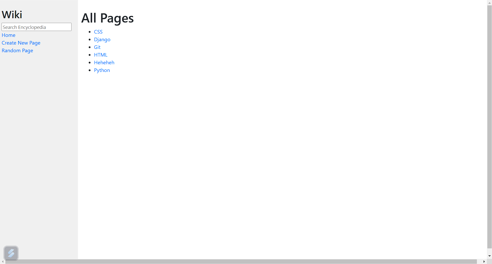
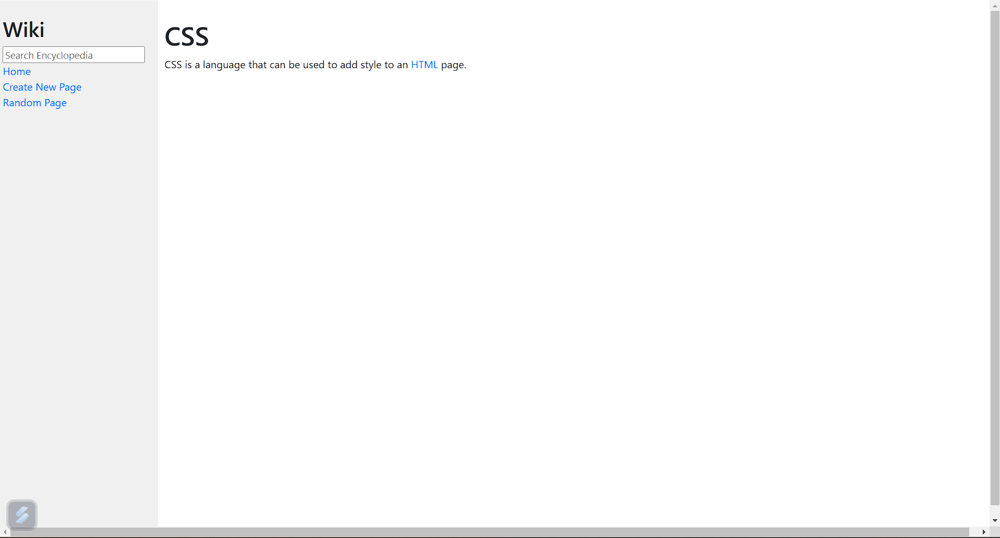
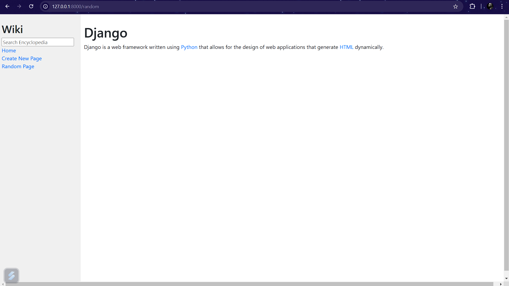
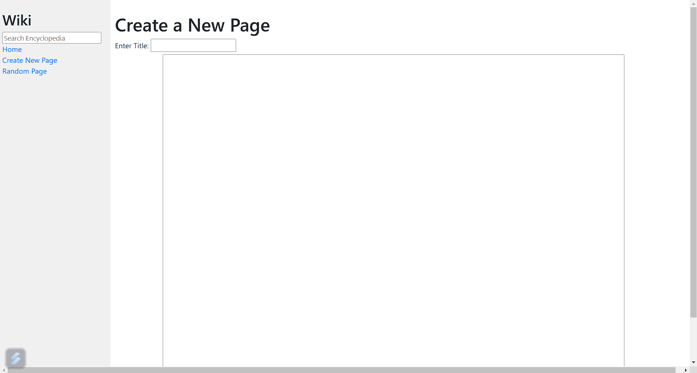

# Wiki-Clone

This is a backend focused wiki application built in Django and using Python packages such as markdown2 to convert markdown to HTML. The app allows users to create and read Wikipedia Pages which are stored as markdown but can be displayed in HTML Format when loaded through the website.

## Wiki Functionalities

- **Create Entries**: Users can create new encyclopedia entries by providing a title and content in Markdown format.
- **View Entries**:
  - Users can view encyclopedia entries with Markdown content rendered as HTML.
- **Random Entry**:
  - Users can view a random entry from the encyclopedia.

## Tech Stack

- **Frontend**: HTML, Vanilla CSS
- **Backend**: Django

## Previews

### Home Page



### Wiki Page



### Random Page



### Create Page



## Installation

### Prerequisites

- Python
- Git Bash
- pip3

### Clone the Repository

```bash
git clone https://github.com/Viv-Dave/wiki-clone.git
cd wiki-clone
```

### Install Dependencies

Install and Create a Python Virtual Environment:

```bash
pip install --upgrade virtualenv
python -m venv .venv
```

Activate the Virtual Environment:

```bash
source ~/YOUR-PATH/wiki-clone/.venv/Scripts/activate
pip3 install Django
(Select Interpreter as the .venv python interpreter and not the global one in VSCode)
```

Install markdown2:

```bash
pip3 install markdown2
```

### Running the App

#### Backend (Django)

```bash
python manage.py runserver
```

The app will run on `http://127.0.0.1:8000/`.

## License

This project is licensed under the MIT License.
